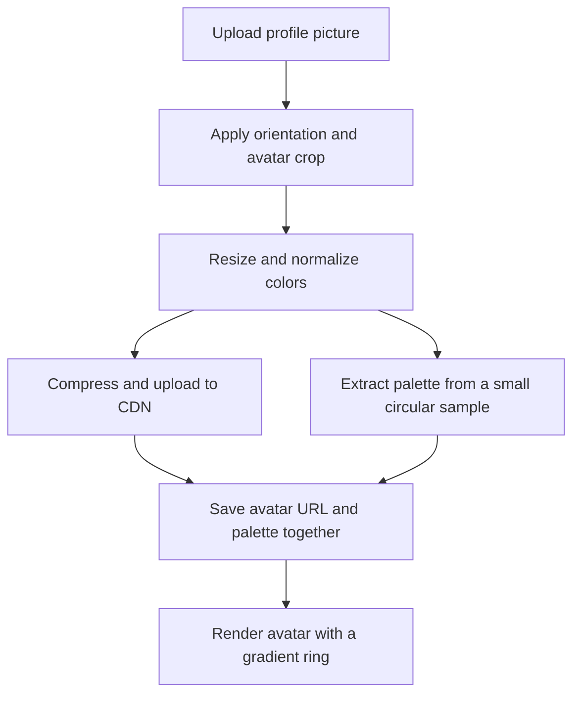

# Avatar ring prototype

Status: brainstorming only. No implementation yet.

## Idea

Allow users to upload a profile picture, process it through the existing media pipeline for compression and CDN upload, and render a gradient ring using three representative colors from the avatar.

Each uploaded avatar produces a CDN URL and a small color palette. The frontend uses that palette to draw the ring.

Interpret “three primary colors” as three representative, visually distinct colors. Picking the three most frequent colors can produce three nearly identical shades of the background.

## Proposed pipeline

This assumes the existing media pipeline processes images before uploading to the CDN. The current pipeline has not been inspected.



## Palette extraction

Extract colors from what the user will actually see. If a landscape photo is cropped to a face, trees outside the crop should not determine the ring color.

1. Apply the same orientation, crop, and resize used for the displayed avatar. Normalize to sRGB so extracted colors have a predictable interpretation.
2. Create a small sample, initially around `64 × 64` pixels. Ignore pixels outside the visible circle.
3. Ignore fully transparent pixels and reduce the influence of almost transparent pixels.
4. Group similar pixel colors into roughly 6–8 candidate colors using a palette extraction algorithm such as median cut or clustering.
5. Select three candidates, balancing how much of the image they occupy against how distinct they are.

The sample size and candidate count are starting parameters to experiment with, not requirements.

Begin with the most common candidate. Select subsequent colors by considering both frequency and distance from colors already selected. This prevents a blue sky from consuming all three slots with slightly different blues.

## Faithful versus expressive colors

A portrait against a beige wall might naturally produce beige, brown, and black. That can be a correct palette but an understated ring.

Start with faithful colors, then compare a second mode that gives moderately saturated colors more weight. Avoid aggressively boosting saturation, which can make skin tones look orange.

| Avatar or condition | Suggested behavior |
| --- | --- |
| Black-and-white photo | Keep a grayscale ring. |
| One dominant color | Repeat it or use subtle lighter/darker variants. |
| Transparent logo | Sample visible pixels and use a defined background behind the rendered avatar. |
| Very light or dark picture | Add a small neutral gap between avatar and ring. |
| Extraction failure | Keep the avatar upload successful and show a default ring. |

Lighter or darker variants are derived colors rather than colors extracted from the picture. Keep that distinction visible in the prototype.

## Stored metadata and processing

Store the palette with the avatar. A conceptual upload result:

```json
{
  "avatarUrl": "https://cdn.example.com/avatars/unique-image.webp",
  "ringColors": ["#355C7D", "#C06C84", "#F8B195"],
  "paletteVersion": 1
}
```

Compute the palette once per uploaded avatar or crop change. Associate it with that specific image version, and publish the URL and palette together so a new picture never briefly gets the previous picture's ring.

Keep a palette version to support later changes to the selection algorithm.

For the prototype, calculate the palette inside the upload processing step. A separate background job adds coordination that probably is not useful yet. Extraction can use the processed pixels already available before encoding, without downloading the image back from the CDN.

## Ring rendering

For a web frontend, use a circular wrapper with a CSS `conic-gradient()`. Conic gradients transition colors around a center point. Repeat the first color at the end so the transition closes smoothly.

Reference: [MDN conic-gradient documentation](https://developer.mozilla.org/en-US/docs/Web/CSS/Reference/Values/gradient/conic-gradient).

Arrange the layers as a gradient circle, a thin background-colored gap, and the circular avatar inside it. Start with equal spacing for the three colors and a static ring. Keep ring thickness adjustable.

## Prototype evaluation

The prototype screen should show:

- The uploaded avatar.
- The three extracted color swatches.
- The resulting ring at a few actual display sizes.
- Faithful and saturation-weighted selection side by side.
- Light and dark backgrounds.

Test portraits, logos, illustrations, and monochrome photos first. Evaluate whether the palettes produce appealing rings before fine-tuning compression or adding gradient animation.
